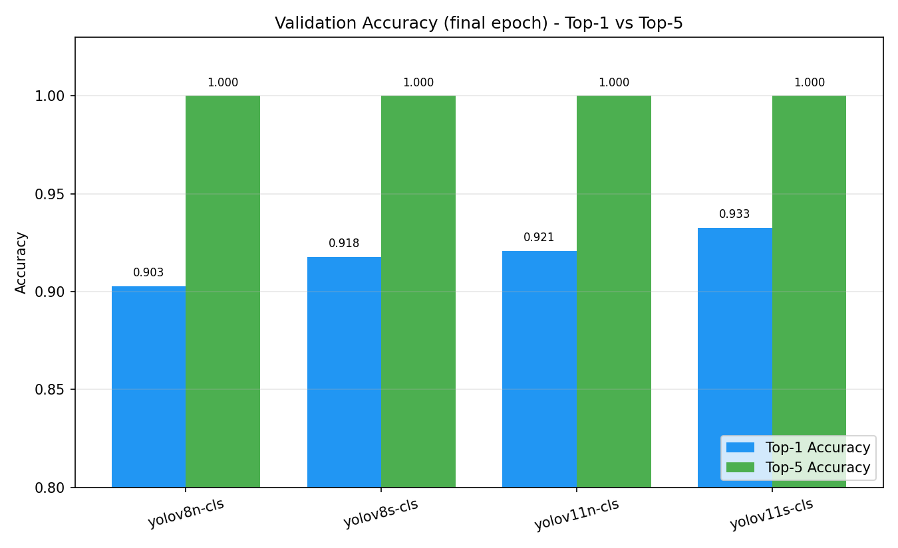
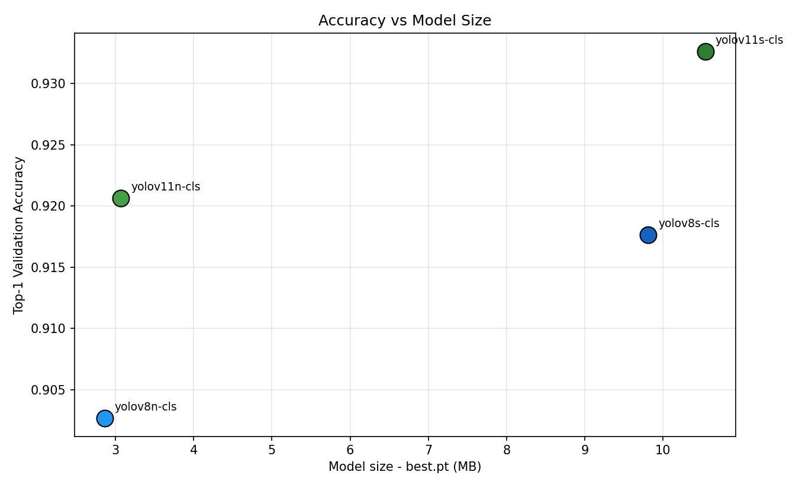
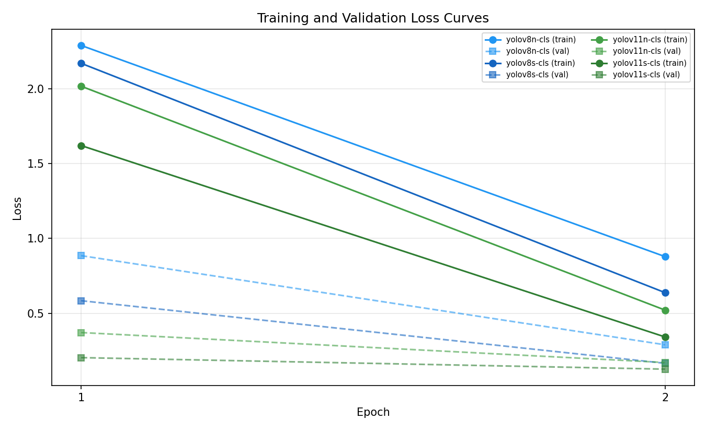
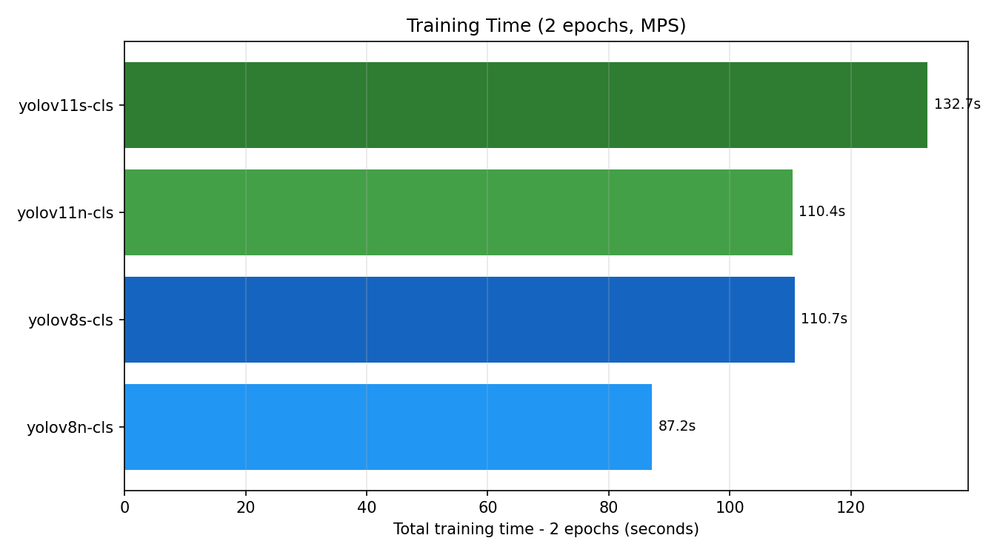
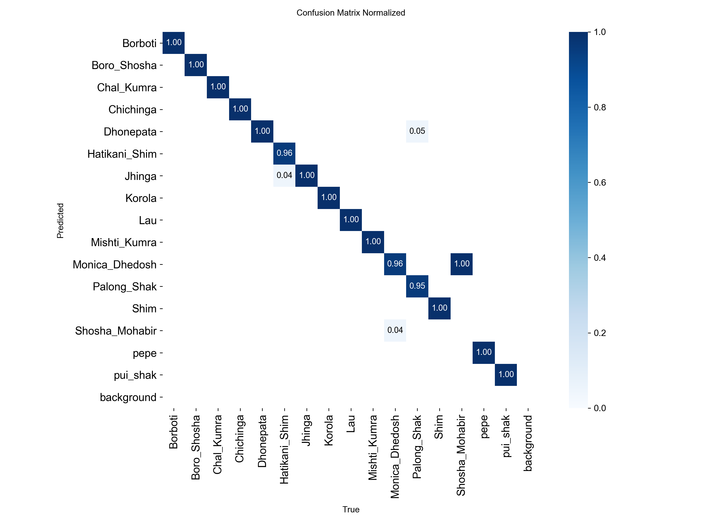
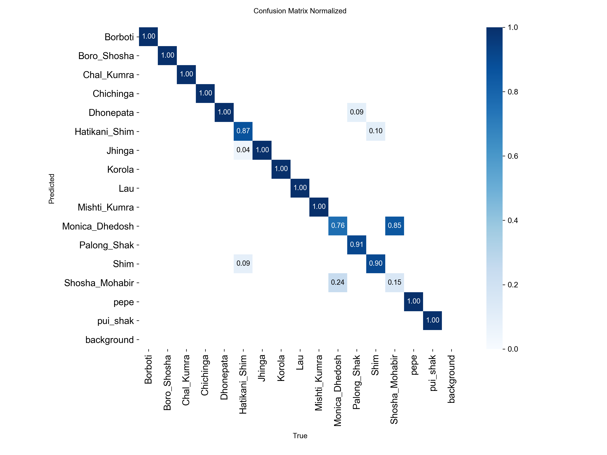
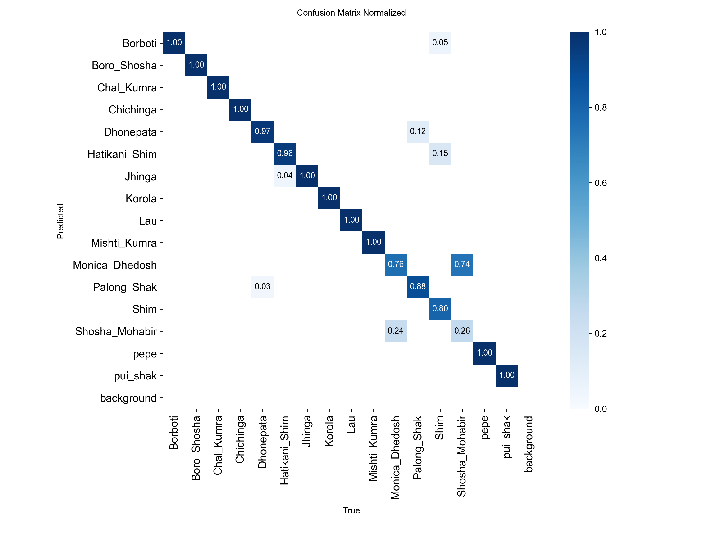
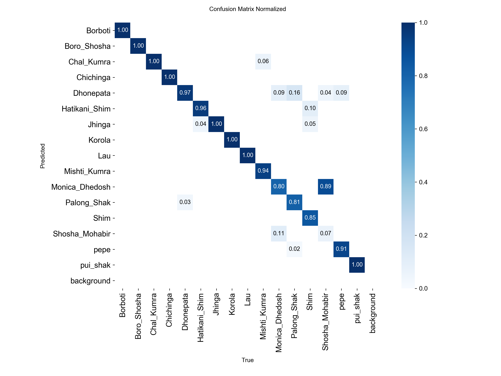

# Comparison of Output Quality of YOLO Classification Models on a Single Seed/Vegetable Image Dataset

**Project:** Seed Recognition — YOLO Classification Comparison
**Prepared as a working overview for the thesis write-up.**
**Date:** 20 May 2026

> **Reading note.** This document is a complete, factual overview of the project code and the outputs that currently exist on disk. All numbers come from the actual training logs (`runs/<model>/results.csv`) and the confusion matrices Ultralytics produced. Two things you should keep in mind throughout: (1) every model here was trained for **only 2 epochs**, so these are early-stage results, not converged final results; and (2) the dedicated test-set scoring step (`evaluate.py` → `results/evaluation_results.json`) never completed, so per-class precision/recall/F1 numbers are not yet available. Both points are explained in detail below.

---

## 1. Aim of the Study

The objective is to compare the **output quality of four different YOLO image-classification models on one and the same dataset**, holding the data, image size, and training settings constant so that any difference in performance can be attributed to the model architecture rather than to the data or the training recipe.

The four models compared are two generations of Ultralytics YOLO classifiers, each in a "nano" (n) and a "small" (s) size:

| Model | Architecture generation | Size variant | Pretrained weights file |
|---|---|---|---|
| `yolov8n-cls` | YOLOv8 | nano | `yolov8n-cls.pt` |
| `yolov8s-cls` | YOLOv8 | small | `yolov8s-cls.pt` |
| `yolov11n-cls` | YOLO11 | nano | `yolo11n-cls.pt` |
| `yolov11s-cls` | YOLO11 | small | `yolo11s-cls.pt` |

This 2×2 design lets the thesis answer two questions at once: *does the newer YOLO11 architecture beat YOLOv8?* and *how much does going from nano to small buy you?*

---

## 2. Dataset

The dataset is a **16-class image classification dataset** of Bangladeshi vegetable/seed types. The class names (as used in the code) are:

> Borboti, Boro_Shosha, Chal_Kumra, Chichinga, Dhonepata, Hatikani_Shim, Jhinga, Korola, Lau, Mishti_Kumra, Monica_Dhedosh, Palong_Shak, Shim, Shosha_Mohabir, pepe, pui_shak.

The raw images are organised one folder per class and split into train/validation/test by `prepare_dataset.py` using a **70% / 15% / 15%** split. The prepared split that exists on disk contains **4,507 images total**:

| Split | Images | Share |
|---|---:|---:|
| Train | 3,150 | ~70% |
| Validation | 668 | ~15% |
| Test | 689 | ~15% |
| **Total** | **4,507** | **100%** |

### Per-class image counts

| Class | Train | Val | Test | Total |
|---|---:|---:|---:|---:|
| Borboti | 176 | 37 | 39 | 252 |
| Boro_Shosha | 240 | 51 | 52 | 343 |
| Chal_Kumra | 210 | 45 | 45 | 300 |
| Chichinga | 218 | 46 | 48 | 312 |
| Dhonepata | 128 | 27 | 29 | 184 |
| Hatikani_Shim | 211 | 45 | 46 | 302 |
| Jhinga | 209 | 44 | 46 | 299 |
| Korola | 212 | 45 | 46 | 303 |
| Lau | 209 | 44 | 46 | 299 |
| Mishti_Kumra | 224 | 48 | 48 | 320 |
| Monica_Dhedosh | 210 | 45 | 46 | 301 |
| Palong_Shak | 194 | 41 | 43 | 278 |
| Shim | 88 | 18 | 20 | 126 |
| Shosha_Mohabir | 211 | 45 | 46 | 302 |
| pepe | 214 | 45 | 47 | 306 |
| pui_shak | 196 | 42 | 42 | 280 |
| **Total** | **3,150** | **668** | **689** | **4,507** |

The dataset is **moderately imbalanced**: the largest class (`Boro_Shosha`, 343 images) has nearly **2.7×** the images of the smallest (`Shim`, 126 images). This is worth mentioning in the thesis because the smaller classes (`Shim`, `Dhonepata`) are the ones most likely to be confused, which is exactly what the confusion matrices show.

All images are resized to **224×224** pixels for classification.

---

## 3. Methodology and Pipeline

The project is organised as a clean, reproducible four-stage pipeline orchestrated by `main.py`:

1. **Prepare** (`prepare_dataset.py`) — flattens raw class subfolders and creates the train/val/test split.
2. **Train** (`train_ultralytics.py`) — fine-tunes each of the four pretrained YOLO classifiers on the dataset.
3. **Evaluate** (`evaluate.py`) — runs each trained model on the **test** split and computes accuracy, precision, recall, F1, a confusion matrix, inference speed, and model size.
4. **Compare** (`compare_results.py`) — turns the evaluation JSON into comparison charts, a LaTeX table, and a text summary report.

Every stage logs metrics and artifacts to a local **MLflow** tracking store (`mlruns/`), so runs can be compared interactively with `mlflow ui`.

### Controlled (identical) training settings

To make the comparison fair, all four models were trained with the **same hyperparameters**, confirmed from each run's `args.yaml`:

| Setting | Value |
|---|---|
| Epochs | **2** |
| Batch size | 32 |
| Image size | 224 × 224 |
| Optimizer | auto (Ultralytics chooses) |
| Initial learning rate (`lr0`) | 0.01 |
| Warmup epochs | 3.0 |
| Device | Apple Silicon GPU (`mps`) |
| Early-stopping patience | 15 |

This is a methodologically sound setup: by changing *only* the model and keeping everything else fixed, the study isolates the effect of architecture and model size on output quality.

---

## 4. Results

> ⚠️ **Important caveat — these are 2-epoch results.** The configuration (`config.py`) sets `EPOCHS = 2`, and the logs confirm each model saw only two passes over the training data. Two epochs is a quick smoke-test, not a converged training run. The accuracy values are already high (90–93%) because the models start from ImageNet-pretrained weights, but **for the final thesis these runs should be repeated with substantially more epochs** (e.g. 50–100, with the patience-15 early stopping already in place) to obtain stable, defensible numbers. The losses are still falling steeply at epoch 2 (see the loss curves), which is direct evidence that the models had not finished learning.

### 4.1 Headline comparison (final-epoch validation metrics)

These figures are read directly from each model's `results.csv` at epoch 2. Top-1/Top-5 accuracy and losses are measured on the **validation** split during training; model size is the on-disk size of the saved `best.pt`; training time is wall-clock for the 2-epoch run on MPS.

| Model | Top-1 Acc | Top-5 Acc | Train loss | Val loss | Size (best.pt) | Train time (2 ep) |
|---|---:|---:|---:|---:|---:|---:|
| yolov8n-cls | 0.9027 | 1.000 | 0.879 | 0.289 | 2.86 MB | 87.2 s |
| yolov8s-cls | 0.9177 | 1.000 | 0.638 | 0.165 | 9.81 MB | 110.7 s |
| yolov11n-cls | 0.9207 | 1.000 | 0.521 | 0.170 | 3.07 MB | 110.4 s |
| **yolov11s-cls** | **0.9326** | **1.000** | **0.342** | **0.126** | 10.54 MB | 132.7 s |

**Best model on every quality metric: `yolov11s-cls`** (highest Top-1 accuracy, lowest training and validation loss). The smallest and fastest-to-train model, `yolov8n-cls`, is also the weakest.

The ranking is consistent and intuitive:

> **yolov11s-cls (0.933) > yolov11n-cls (0.921) > yolov8s-cls (0.918) > yolov8n-cls (0.903)**

Two clear trends fall out of this:

- **Newer architecture wins at equal size.** YOLO11 beats YOLOv8 in both the nano comparison (0.921 vs 0.903) and the small comparison (0.933 vs 0.918).
- **Bigger wins within a generation.** The "small" variant beats the "nano" variant in both generations.
- Notably, **`yolov11n-cls` (nano, 3.07 MB) edges out `yolov8s-cls` (small, 9.81 MB)** — the newer nano model matches an older model 3× its size, which is a strong point to make in the thesis about architectural efficiency.

All four models reach a **Top-5 accuracy of 1.000**, meaning the correct class is essentially always among the model's top five guesses; the discriminating metric here is Top-1.

### 4.2 Accuracy comparison

*Top-1 accuracy rises steadily from YOLOv8-nano to YOLO11-small; Top-5 is saturated at 1.0 for every model.*

### 4.3 Accuracy vs model size

*Accuracy increases with model size, but with diminishing returns. The two YOLO11 points sit above the two YOLOv8 points, showing the architecture improvement is "free" in the sense that yolov11n delivers near-small accuracy at nano size.*

### 4.4 Training and validation loss

*Both losses are still dropping sharply between epoch 1 and epoch 2 for every model — the clearest visual evidence that 2 epochs is not enough and the models have not converged. `yolov11s-cls` has the lowest loss at every point.*

### 4.5 Training cost

*Larger and newer models cost more to train. The accuracy gain therefore comes at a compute cost, which the thesis can frame as an accuracy-vs-efficiency trade-off.*

---

## 5. Confusion Matrices (Test Split)

These normalised confusion matrices were generated by Ultralytics when each trained model was run on the **test** split. The diagonal is the per-class recall (fraction of each true class predicted correctly); off-diagonal cells are confusions. A perfect model would be a clean blue diagonal.

### Best model — yolov11s-cls

Almost perfectly diagonal. Nearly every class scores 1.00, with only minor leakage (e.g. a small `Hatikani_Shim`↔`Jhinga` confusion and a slight `Dhonepata`/`Shosha_Mohabir` mix-up). This is the cleanest matrix of the four.

### yolov11n-cls

### yolov8s-cls

### Weakest model — yolov8n-cls

Visibly more off-diagonal mass. The hardest classes for this model are the leafy/gourd group — `Monica_Dhedosh` (~0.80 recall), `Palong_Shak` (~0.81), and `Shim` (~0.85) — with cross-confusions into `Dhonepata`, `Mishti_Kumra` and `Shosha_Mohabir`. The smaller-sample classes suffer most, consistent with the dataset imbalance noted in Section 2.

**Take-away for the thesis:** the confusion matrices tell the same story as the accuracy numbers but in finer detail — model quality improves in the order yolov8n → yolov8s → yolov11n → yolov11s, and the gains are concentrated in the visually similar leafy-vegetable classes where the weaker model struggles.

---

## 6. What Each Source File Does

A short tour of the codebase, useful for the "Implementation / Methodology" chapter:

- **`config.py`** — single source of truth: paths, the 16 class names, the four model definitions, image size (224), split ratios (70/15/15), and training hyperparameters (epochs, batch, lr, device).
- **`download_dataset.py`** — optional download of the raw dataset from a Google Drive folder.
- **`prepare_dataset.py`** — flattens raw class subfolders and produces the train/val/test split.
- **`train_ultralytics.py`** — trains one or all models (`--all`), saves checkpoints under `runs/<model>/weights/best.pt`, and logs parameters, training time, model size, and accuracy to MLflow.
- **`evaluate.py`** — intended to run each trained model on the test split and compute accuracy, **precision, recall, F1 (per-class and macro)**, a confusion matrix, inference speed (100-run benchmark), and model size, writing everything to `results/evaluation_results.json`.
- **`compare_results.py`** — intended to read that JSON and produce the comparison charts (accuracy bars, precision/recall/F1, speed-vs-accuracy, per-class F1, radar, model-size, training curves), a LaTeX table, and a text summary report.
- **`main.py`** — runs the four stages in order and wires up MLflow.

---

## 7. Known Gaps and Recommendations Before the Final Thesis Run

This section is deliberately candid so the thesis methodology is airtight.

1. **Train for more than 2 epochs.** This is the single most important change. The current `EPOCHS = 2` produces an unconverged smoke-test. Set epochs to ~50–100; the `patience=15` early stopping already in the code will stop training automatically once validation stops improving. Re-run `python main.py` to regenerate all results.

2. **Complete the test-set evaluation.** The `results/` folder is currently empty — `evaluate.py`/`compare_results.py` did not finish, so there is **no `evaluation_results.json`** and therefore **no precision, recall, F1, or inference-speed numbers** yet. Running `python main.py --step evaluate` followed by `python main.py --step compare` will produce these, plus the project's own richer comparison charts (per-class F1, radar chart, precision/recall/F1 bars). The accuracy and confusion-matrix results in this document are real and complete; the precision/recall/F1 table is the one piece still outstanding.

3. **Address class imbalance.** With `Shim` at 126 images vs `Boro_Shosha` at 343, consider reporting **macro-averaged** metrics (the code already computes these) and possibly class weighting or augmentation for the small classes that the confusion matrices flag as hardest.

4. **Report on a fixed test split, not validation.** The headline numbers above are validation-split accuracies logged during training. Once `evaluate.py` is run, prefer the **test-split** metrics for the final thesis claims, since the test set was never seen during training or model selection.

5. **Random seed / repeated runs.** For a defensible comparison, fix a random seed and ideally repeat each training run 3× to report mean ± standard deviation, so the small gaps between models (e.g. yolov11n vs yolov8s, ~0.3 points) can be shown to be real rather than noise.

---

## 8. One-Paragraph Summary (drop-in for an abstract)

Four Ultralytics YOLO image-classification models — YOLOv8 and YOLO11, each in nano and small variants — were fine-tuned on an identical 16-class, 4,507-image Bangladeshi seed/vegetable dataset (70/15/15 split, 224×224 input) under identical hyperparameters, isolating the effect of architecture and model size on output quality. After a short 2-epoch training run, `yolov11s-cls` achieved the best validation Top-1 accuracy (93.3%) and the cleanest test-set confusion matrix, followed by `yolov11n-cls` (92.1%), `yolov8s-cls` (91.8%), and `yolov8n-cls` (90.3%). Two consistent trends emerged: the newer YOLO11 architecture outperformed YOLOv8 at equal model size, and the small variants outperformed the nano variants — with the YOLO11 nano model notably matching the larger YOLOv8 small model despite being roughly one-third its size. All models reached 100% Top-5 accuracy. These results are preliminary 2-epoch figures and should be regenerated with longer training and the full test-set precision/recall/F1 evaluation before final reporting.

---

*Figures referenced in this document are stored in the `figures/` folder next to this file.*
